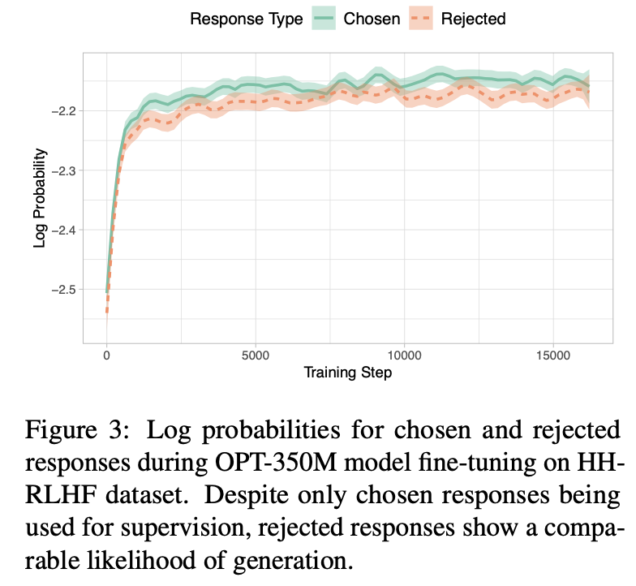
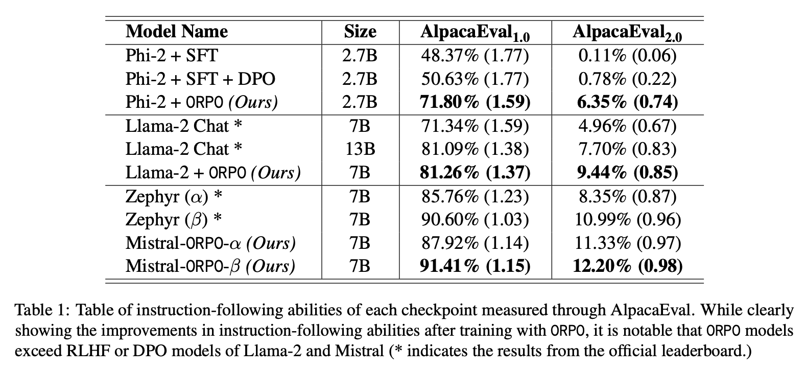

# ID2223 lab2 2024

## Foundation LLMs

Initially, we experimented with several models, including [Llama-3.2-1B-Instruct](https://huggingface.co/meta-llama/Llama-3.2-1B-Instruct), [Mistral-Small-Instruct-2409](https://huggingface.co/mistralai/Mistral-Small-Instruct-2409) and [Phi-3.5-mini-instruct](https://huggingface.co/microsoft/Phi-3.5-mini-instruct). To efficiently evaluate their performance, we trained each model for 60 steps. This choice allowed us to observe early convergence trends, quickly perform an initial screening of model performance, and conserve computational resources. After training each model for 60 steps, we observed that Phi-3.5-mini-instruct had the lowest evaluation loss.

However, Phi trains and inferences much slower than Llama, and through further research, including insights from [this tweet](https://x.com/AIatMeta/status/1839018085329809831) posted by [AI at Meta](https://x.com/AIatMeta), showed that Llama 3.2 performs better than Phi-3.5-mini on most benchmarks.

Due to resource limit and our goal for fine tuning, we decided to continue using Llama 3.2 as the base model.

## Dataset

We used [argilla/Capybara-Preferences](https://huggingface.co/datasets/argilla/Capybara-Preferences), which is built on top of [LDJnr/Capybara](https://huggingface.co/datasets/LDJnr/Capybara), in order to generate a preference dataset out of an instruction-following dataset

We used LDJnr/Capybara as the evaluation dataset.

## Model-centric approach

<!-- e.g., tune hyperparameters, change the fine-tuning model architecture, etc. -->

We utilized the **grid search** method to optimize the following hyperparameter combinations:  
- **LoRA hyperparameters**: `r` and `lora_alpha`  
- **ORPOConfig hyperparameters**: `learning_rate`, `weight_decay`, and `beta`  

To enhance efficiency and reduce unnecessary computational overhead, we implemented an **early stopping strategy** during the search process. This allowed us to terminate training early when validation loss showed no significant improvement, enabling a faster search for the optimal parameter set.

Original post presents a supervised fine-tuning(SFT) architecture based on a series of models. However, accoring to the [paper](https://arxiv.org/abs/2403.07691) by Hong, J, it will also generate undesirable answers.

Therefore, we added a preference alignment stage to widden the gap between the preferred and rejected outputs. Traditionally, the two stages are separate and needs Reinforcement Learning with Human Feedback (RLHF) or Direct Preference Optimization (DPO). Inspired by Hong, J's team, we adopted the ORPO method, which elegantly combines these two stages into one and showed clear improvements compared with previous approaches, as demonstrated in the literature.

We implemented our ORPO method following the [unsloth documentation](https://docs.unsloth.ai/basics/reward-modelling-dpo-orpo-kto).

## Evaluation

It's hard to determine how to compare two large language models. Traditional evaluation metrics based on the similarity between outputs and reference answers (e.g., ROUGE, BLEU) seems ineffective.

The [LLM-as-a-judge](https://huggingface.co/learn/cookbook/en/llm_judge) approach seems to be a good option. Due to cost of proprietary models like chatgpt, we used an open-source 3.8B LM judge: [Flow Judge](https://github.com/flowaicom/flow-judge) for LLM system evaluations.

We compared our model with the base Llama-3.2-1B-Instruct model. Since the flow judge isn't capable of processing large amounts of data, we picked 200 random questions in the evaluation dataset and the judge rated each responses by each model. As a result, the fine-tunned model scored higher than the original model and only sacrificed about 0.2 seconds for each inference.

<!-- ## Reference

[1] Hong, J., Lee, N., & Thorne, J. (2024, March 12). ORPO: Monolithic Preference Optimization without Reference Model. arXiv.org. <https://arxiv.org/abs/2403.07691> -->

## Appendix

We attempted to use Flow Judge on a Windows system, but encountered an issue because Flow Judge relies on `os.setsid`, a function that is only supported on Linux systems. To work around this, we decided to continue our attempts within a Jupyter Notebook environment in WSL (Windows Subsystem for Linux). However, in this setup, we found that Flow Judge was unable to connect to the Llamafile server running on the host machine,which is started by function in Flow Judge, preventing the evaluation and testing from proceeding as expected.
