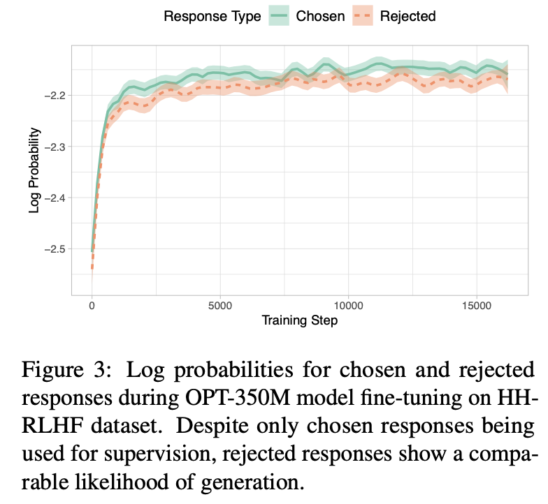
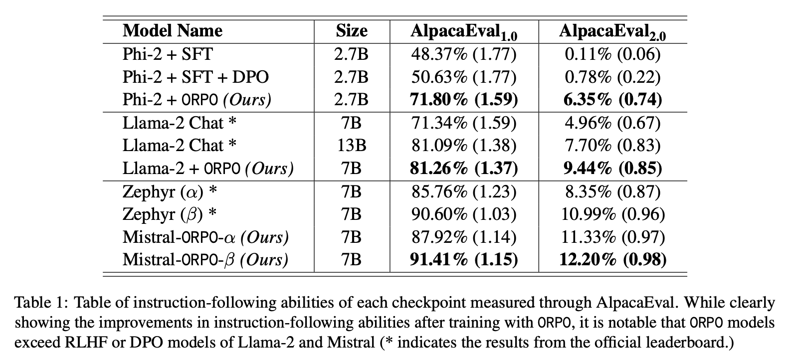

# Foundation LLMs
Inference will be on CPUs, so big models will be slow. We selected `Llama-3.2-1B-Instruct`, which is a small model and inference fast on CPUs. It's also suitable for fine-tuning.

# Dataset
We used `orpo-dpo-mix-40k`[2], which is a dataset specialized in ORPO.

# Model-centric approach
e.g., tune hyperparameters, change the fine-tuning model architecture, etc.

TODO: tune hyperparameters

Original post presents a supervised fine-tuning(SFT) architecture based on a series of models. However, it will also generate undesirable answers[1].

Therefore, we added a preference alignment stage to widden the gap between the preferred and rejected outputs. Traditionally, the two stages are separate and needs Reinforcement Learning with Human Feedback (RLHF) or Direct Preference Optimization (DPO). Inspired by ORPO[1][5], we used ORPO which elegantly combined these two stages into one and showed clear improvements compared with previous approaches. 

# Evaluation
It's hard to determine how to compare two large language models. Traditional evaluation metrics based on the similarity between outputs and reference answers (e.g., ROUGE, BLEU) seems ineffective.

The LLM-as-a-judge[3] approach seems to be a good option. Due to cost of proprietary models like chatgpt, we used an open-source 3.8B LM judge: Flow Judge[4] for LLM system evaluations.

We compared our model with the base `Llama-3.2-1B-Instruct` model. 

TODO: results

# Reference
[1] Hong, J., Lee, N., & Thorne, J. (2024, March 12). ORPO: Monolithic Preference Optimization without Reference Model. arXiv.org. https://arxiv.org/abs/2403.07691

[2] mlabonne/orpo-dpo-mix-40k · Datasets at Hugging Face. (2001, June 2). https://huggingface.co/datasets/mlabonne/orpo-dpo-mix-40k

[3] Using LLM-as-a-judge 🧑‍⚖️ for an automated and versatile evaluation - Hugging Face Open-Source AI Cookbook. (n.d.). https://huggingface.co/learn/cookbook/en/llm_judge

[4] Flowaicom. (n.d.). GitHub - flowaicom/flow-judge: Code for evaluating with Flow-Judge-v0.1 - an open-source, lightweight (3.8B) language model optimized for LLM system evaluations. Crafted for accuracy, speed, and customization. GitHub. https://github.com/flowaicom/flow-judge

[5] Fine-tune Llama 3 with ORPO. (n.d.). https://huggingface.co/blog/mlabonne/orpo-llama-3